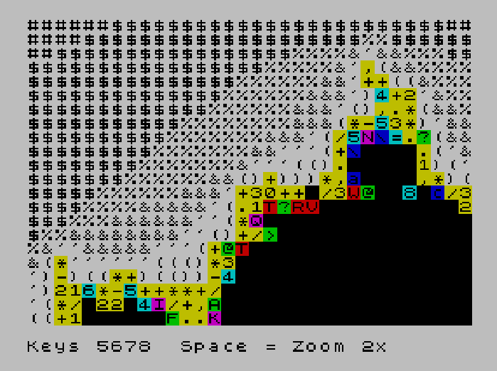

# Mandelbrot Explorer for the Sinclair ZX Spectrum

A character-based Mandelbrot-Set explorer in BASIC (in 10 lines or less!!)

Prints a Mandelbrot Set as characters. Since calculating the Mandelbrot is quite intensive for an 8-bit machine, and the ZX Spectrum is a 1980's computer, this takes some time to execute and complete.

Originally started for the BASIC 10 Liner contest https://gkanold.wixsite.com/homeputerium/rules2021




# Keys

5-6-7-8 for moment (7=Up, 5=Left, 6=Down, 8=Right) (not shifted)

Space bar for zoom - 1x, 2x (then resets to 1x)


# Running the Fast version

Load the file 'Mandelbrot_fast.tzx'. It is set to Auto-run. In the Fuse emulator you can do this with Open File menu item. (You could also type LOAD "" from either 128K or 48K basic once you've 'inserted the tape' (in Fuse via the Media->Tape->Open menu). Other Spectrum emulators work as well, of course :-)

The fast version is always up to date - we create the slow Sinclair BASIC version after working on the fast version.


# Compiling the Fast version

The fast version uses Boriel's ZXBasic compiler: https://zxbasic.readthedocs.io/en/latest/archive/  We suggest you get it from here to get the latest version - although you can install an older version using pip. 

The command line we use to compile it to a tape file is:

    ../zxbasic/zxbc.py Mandelbrot_fast.bas  --tzx --BASIC --autorun --string-base=1 -O2 --strict-bool --strict

## Command Line Options

The string-base is required so that the Sinclair BASIC match. The strict bool so we can use bool in complex expressions like Sinclair BASIC.


# Loading the slow Sinclair BASIC version:

Load the tap file into an emulator, for example Fuse. The tape should load into a 48K or 128K machine. It should also load into a Spectrum Next - although this hasn't been tested.

You will need to type 'RUN' after loading the program (if you type LOAD "" from BASIC, or go to basic and type run) - it's not set to auto-run the program. Feel free to view the source in Spectrum BASIC. You will see this is the same as the .bas files in the github repo.

This Spectrum BASIC version is slow - the compiled version is better.

The spectrum version was converted to a tape with this command:

    ../zmakebas-1.5.2/zmakebas -o Mandelbrot_slow_SinclairBasic.tap -n mandel Mandelbrot_slow_SinclairBasic.bas


# Source code and notes between the slow and fast versions.

Both the Fast and the Sinclair BASIC versions have the same code except for the first DIM (definitions) on line 10, which defines the variables for the compiler.

The fast version uses fixed point numbers rather than floating point, and due to this the display is very slightly different. 


# About the Authors

Written by Kenny Osborne and Rob Probin, March 2020. We both live in Scotland, with the largest big city being
Glasgow. We are both software engineers who like playing with various technologies outside of our day jobs. 
Rob's second computer (after the the ZX81) was the Sinclair ZX Spectrum 48K, which he used for years before
moving to 16-bit computers. 


# Acknowledgements

 * Based on the Wikipedia article here: https://en.wikipedia.org/wiki/Mandelbrot_set, with the idea of using ASCII characters from a stackoverflow post here: https://stackoverflow.com/questions/811074/what-is-the-coolest-thing-you-can-do-in-10-lines-of-simple-code-help-me-inspir

 * Thanks to Boriel for the ZX BASIC compiler https://github.com/boriel/zxbasic

 * Thanks to http://angrydill.com/wasd/ for showing the impossible is possible. Also for the key movement idea.

 * To Russell Marks for zmakebas - that saved a LOT of typing in a spectrum emulator! It's on github, but you can also get it here: https://derekbolli.wordpress.com/2012/11/16/create-zx-spectrum-basic-program-tap-file-from-text-source-file-in-bbedit-using-zmakebas/


# 'Minified' Source Code

The contest specifies restrictions for source - but no major tricks have been used. It depends whether you count ASCII version or the Sinclair version how many characters. But the text complies with about 213 characters per line on line 90. The following items have been used to reduce the source slightly:

 * One letter variable names.(No conflicts between integer and string to support compiler).
 * Movement is an expression not IF string compares.
 * Multiple statements on each line.

There are 10 lines in this program, and all of them are less than 256 characters long when in ASCII.


This is even without the tokenisation rule allowed for Sinclair machines here: https://gkanold.wixsite.com/homeputerium/proof


# Formatted and Commented Source Code

NOTE: The single line if's have been split across lines. This will NOT compile
in ZXBASIC because you'd need ENDIFs adding - this is just for ease of commenting. Sinclair 
BASIC only has statements on a single line after an IF - and ZXBASIC supports this single line
version.

```
   ' Line 10 sets up the BASIC variables and clears the screen. 
   ' The first three of these define variables only for ZXBASIC.
   ' The first three of these are missing in Sinclair BASIC version. 
10 DIM p,q,t,x,y,x2,y2,r,c,d,e,g,h as FIXED:
   DIM z,f,w,k as Integer:
   DIM v,m as Byte: 

   ' We create an array of characters to print for each interation level
   DIM a$(81):
   FOR i=1 TO 81:
     LET a$(i)=CHR$(32+i):      ' fill a character string array with different characters in each string
   NEXT i:
   CLS:                         ' clear the screen
   LET l$=";"                   ' something unlikely to be entered as a key by default.

   ' Line 20 sets up zoom 1x. 
   ' We jump back to here when zoom is bigger than allowed.
20 LET d=-1:                    ' see variable description for information on variables
   LET e=1: 
   LET g=-2: 
   LET h=1: 
   LET z=22528:                 ' this is the start of the colour (attribute) memory
   LET f=0:                     ' this is how far through the attribute memory the user has moved
   LET m=1                      ' keep track of zoom level (actual zoom uses d,e,g,h,p,q).

   ' Line 30 prints the status line and calculates key step values. 
   ' Space key jumps here.
30 POKE 23659,0:                                            ' allow printing on the bottom 2 lines
   PRINT AT 22,0;"Keys 5678  Space = Zoom ";m;"x";AT 0,0;:  ' print keys, zoom level and set printing to start at top
   POKE 23659,2:                                            ' reset bottom to lines to status ... in case of error or break
   LET p=(h-g)/31:              ' calculate the step interval for y (rows)
   LET q=(e-d)/21:              ' calculate the step internal for x (columns)
   IF m>2 THEN GOTO 20          ' This resets the zoom level when it gets too big. 
                                ' At moment it allows 1x and 2x. We need to do a fix for 4x. 

   ' Line 40 is the main draw screen start 
   ' It loops back here with NEXT c and NEXT r on each character 
40 FOR r=d TO e STEP q:         ' this is the y (row) step in the Mandelbrot set function domain
   FOR c=g TO h STEP p:         ' columns, or the 'x' axis of the screen, stepped in the equation domain
   LET x=0: 
   LET y=0: 
   LET i=1                      ' iteration depth - this is what forms the pattern

50 LET x2=x*x:                  ' save calculating x^2 twice
   LET y2=y*y: 
   IF x2+y2>4 OR i>70 THEN GOTO 80    ' If x2+y2>4 or 70 iterations ... we are done with this character

60 LET o$=l$:                         ' record old key before getting new key
   LET l$=INKEY$:
   IF l$<>"" AND o$<>l$ THEN GOTO 90  ' If someone is pressing a new key, process it. 
                                      ' NOTE: o$=l$ was a quick fix for double key presses.

70 LET t=x2-y2+c:                   ' this is the core of the Mandlebrot-set. See wikipedia page.
   LET y=2*x*y+r:
   LET x=t:
   LET i=i+1:                       ' count the iterations - the number of iterations is the screen colour/character
   GOTO 50                          ' the iterations for this character isn't done yet

80 PRINT PAPER 7-i/10;a$(i);:       ' make a background colour, and print a character
   NEXT c:
   NEXT r: 
   GOTO 30                          ' restart the screen again

90 LET k=CODE l$:                   ' get the code
   LET w=PEEK (z+f):                ' get colour byte from memory
   LET w=((w>127)*(w-128))+(w<128)*w: ' remote bit 7 (128) - that is the flash bit
   POKE z+f,w:                      ' clear the old flashing position
   ' The next line calculates the movement of the cursor based on keys
   LET v=(k=56)-(k=53)+32*((k=54)-(k=55)):  ' These are the codes for the keys 5 6 7 8 which are spectrum cursors keys
   LET f=f+v:                       ' move the cursor
   LET f=(f>=0 AND f<768)*f:        ' if it's off the top or bottom of the screen, reset it to the top-left
   LET w=PEEK(z+f):                 ' get the colour byte from memory. Is this redundant?
   POKE z+f,w+128:                  ' make the new character position flash
   IF l$<>" " THEN GOTO 70          ' if not space bar pressed, carry on with iterations

100 LET m=m*2:                      ' keep track of the zoom level
                                    ' set the  (p & q) ... these are the half the zoomed value (50%)
    LET p=(h-g)/4:LET q=(e-d)/4:    ' NOTE p & q will be reset after the GOTO 30
    LET y=INT(f/32):                ' convert f into height and width ... x and y will be reset afterwards
    LET x=(f-(y*32)):               ' basically f MOD 32 ... where 32 is the screen width in characters
    LET x=g+x*(h-g)/32:             ' x and y mid point of screen zoomed in
    LET x=g+(f-(y*32))*(h-g)/32:
    LET y=d+y*(e-d)/22:             
    LET d=y-q:                      ' set the start/ ends (d & e, g, h)     
    LET e=y+q:
    LET g=x-p:
    LET h=x+p: 
    GOTO 30                         ' start screen again with new zoomed in view
```

## Variable list

The variables are shortened - which doesn't help with meaningful names. Here is a list of variables and their usage:

```
d  = start y coordinate in mandelbrot domain 
e  = end y coordinate in mandelbrot domain
g  = start x coordinate in mandelbrot domain 
h  = start x coordinate in mandelbrot domain 
i  = iteration depth 
p  = mandelbrot domain step for x for every coloum on screen
q  = mandelbrot domain step for y for every coloum on screen
t  = temporary used in calculations for new x and old x can be used in y calculation 
x  = used to calculate mandelbrot 
y  = used to calculate mandelbrot 
x2 = x squared to reduce calculations
y2 = y squared to reduce calculations
r  = screen row (y)
c  = screen column (x) 
z  = colour attribute start address
f  = screen position between 0 and 767
w  = colour attribute byte 
k  = key code (number version of l$)
v  = movement offset
a$ = screen characters to be printed based on depth
o$ = old key string 
l$ = new key string

```

# Future enhancements
 - Figure out why the colours apply to more characters on the Sinclair version
 - Expand the colours 
 - Allow zoom levels of more than 2x
 - Support shifted 5678 and/or WASD/wasd
 - Support held key repeat for movement keys
 - When over black cursor invisible
 - Should CLS on zoom level change
 - Remove redundant peek (if it is redundant)

